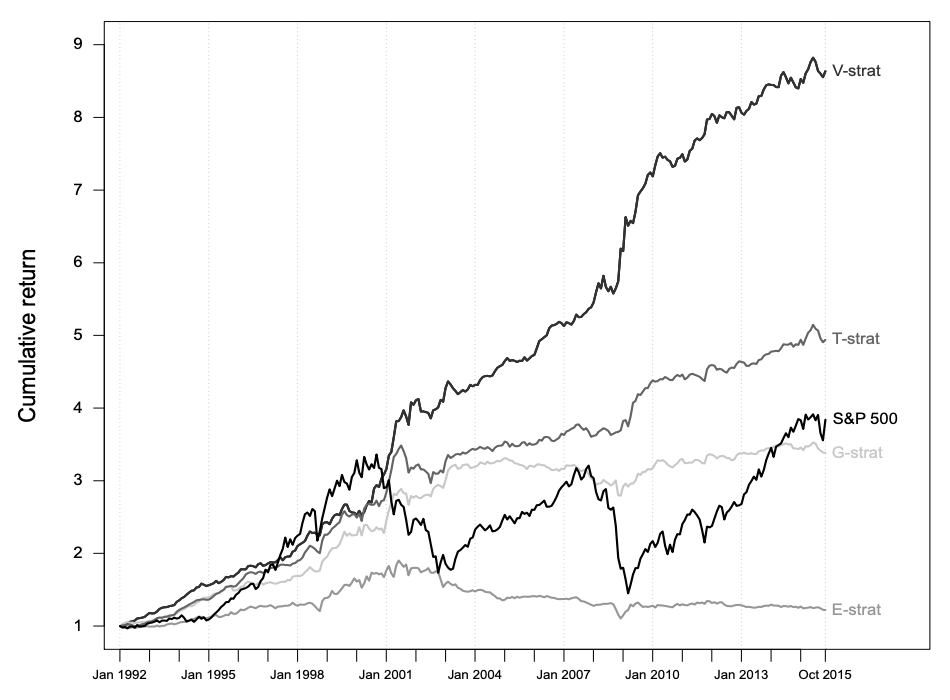

# cpp-vines

`cpp-vines` is a C++23 proof of concept for fitting regular-vine (R-vine)
copula models to aligned numerical series. It is designed for research into
dependence structures in asset returns, although the core library accepts any
aligned floating-point marginals.

Running `./build/example-vine` fits an R-vine to ECDF-transformed log returns
for six assets. It prints the fitted tree structure, copula families,
parameters, and Kendall's tau values, as shown below. The resulting conditional
probability series can also be converted into a cumulative mispricing index
(CMPI) for statistical-arbitrage research.


The project includes:

- Low-latency copula and vine-copula fitting
- Capacity-bounded empirical CDF (ECDF) transformations of log returns
- A Nelder-Mead optimiser implemented in C++
- Optional Python bindings built with pybind11

## How vine copulas support statistical-arbitrage research

Pairs trading models the relative value of two assets. Vine copulas extend
that idea by modelling the dependence between a target asset and several
related assets.

For example, a model could estimate the conditional distribution of asset 5
given five other assets:

$$
P(U_5 \le u_5 \mid U_1=u_1, U_2=u_2, U_3=u_3, U_4=u_4, U_6=u_6) < 0.05
$$

A value below 0.05 places the target observation in the lower tail of its
fitted conditional distribution. In a trading study, this could be interpreted
as a potential long signal for the target asset; a high value could suggest the
opposite. Any resulting position would typically be hedged to limit market
exposure.

The daily conditional probabilities can be centred at 0.5 and accumulated:

$$
\mathrm{CMPI}_t = \sum_{i=1}^{t} \left(\mathrm{MI}_i - 0.5\right)
$$

If this series is mean-reverting, crossings of its rolling Bollinger Bands can
be evaluated as entry signals. See
[Statistical arbitrage with vine copulas](https://www.econstor.eu/bitstream/10419/147450/1/870932616.pdf)
for the research behind this approach. This project computes model outputs; it
does not execute trades or provide a complete backtesting system.



## Lessons learned

Copula fits are sensitive to the input data, model specification, and available
families. A well-calibrated conditional-probability series should average close
to 0.5 over time. With the limited set of families currently implemented,
`cpp-vines` can produce drift. Because CMPI accumulates each deviation from
0.5, even a small persistent bias can become substantial.

The library is therefore not ready for production trading. Its fitted tree
structures, Kendall's tau values, and parameters have been compared with
`pyvinecopulib` as a sanity check and were broadly similar in the cases tested.
Informal local timing tests took roughly five seconds with `cpp-vines` and
eight seconds with the comparison library, making `cpp-vines` about 30% to 40%
faster for that workload. Treat these figures as indicative only; the project
does not yet include a reproducible benchmark suite.

## Highlights

- **Fixed-capacity numerical series.** `FixedSeries` maintains a rolling
  window with constant-time updates to its running sum and mean. It can track
  prices, log returns, or other numerical inputs without allowing the active
  window to grow indefinitely.

- **Asset helpers.** `Asset` validates prices, calculates log returns, and
  exposes empirical marginal (`u`) values for copula fitting.

- **Capacity-bounded empirical CDF.** `Ecdf` transforms a numerical series into
  marginal values while limiting the number of observations it stores.

- **Seven pair-copula candidates.** Each selected edge evaluates Independence,
  Gaussian, and Student-t copulas. Positive-dependence edges also evaluate
  Clayton, survival Clayton, Gumbel, and survival Gumbel copulas. Parametric
  fits run concurrently, and the successful family with the lowest BIC is
  selected by default; AIC is also available.

- **Automatic R-vine construction.** The fitter ranks dependence using
  Kendall's tau, builds maximum-dependence spanning trees, enforces the
  regular-vine proximity condition, and carries h-function conditionals into
  higher trees.

- **Conditional-probability and CMPI outputs.** A fitted vine provides the
  final pair's conditional-probability series in both directions. Results are
  available as raw probabilities, cumulative CMPI values, or CMPI z-scores.

- **Explicit error handling.** Public C++ operations use
  `std::expected<..., SmartError>` for invalid input, failed fits, and
  unavailable fitted state.

- **Optional Python bindings.** A pybind11 layer exposes assets, copulas,
  edges, fitted trees, and final results to Python. The C++ core is
  hand-written; the Python convenience layer was developed with LLM
  assistance.

## C++ performance design

The project uses several low-latency and memory-conscious techniques in its
hot data and vine-construction paths:

- **Preallocated rolling storage.** `FixedSeries` allocates its backing storage
  once, updates its rolling sum in constant time, and exposes its active window
  without allocating for every observation. The tracked window is periodically
  compacted in place instead of growing indefinitely.

- **Non-owning views where data is already owned.** The C++ fitting interface
  accepts `std::span<const double>` marginals, and final fitted probabilities
  are returned as spans. This avoids copies between asset storage, vine
  fitting, and result inspection. These views remain valid only until the vine
  is refitted or destroyed.

- **Reserved working buffers.** Candidate, tree, conditional-probability, and
  ECDF containers reserve their expected capacity before being populated,
  reducing reallocations during fitting and streaming updates.

- **Compact vine metadata.** Conditioned and conditioning variable sets are
  represented as integer bitmasks. Union, intersection, and proximity checks
  therefore use inexpensive bitwise operations instead of heap-backed sets.

- **Fit only selected edges.** Candidate links are ranked by Kendall's tau to
  build each spanning tree. Copula optimisation is then performed only for the
  selected tree edges, rather than for every possible candidate pair.

- **Parallel family selection.** Parametric copula-family optimisations for a
  selected edge run through `std::async`, reducing wall-clock fitting time on
  systems with available CPU parallelism. Independence is evaluated
  immediately because it has no parameters to optimise.

The ECDF uses a sorted `std::vector`, so insertion and CDF recalculation are
linear in the configured ECDF window. Vine fitting and numerical optimisation
are also batch operations, not hard real-time guarantees. These techniques
primarily reduce copying, allocation churn, and avoidable copula fits. Profile
representative workloads before treating the library as a latency-critical
production component.

## Model scope

`max_nodes` controls the requested number of variables in a fitted vine and
defaults to six. R-vine fitting cost grows quickly with both the number of
series and the number of candidate pair-copula families, so modest node counts
are a practical starting point for this proof of concept.

The project currently fits a model to the supplied observations and reports
the corresponding conditional series. It does not yet support model
serialisation, online refitting, or out-of-sample scoring of a saved vine.

## Requirements

- CMake 3.23 or later
- A C++23 compiler
- Boost headers
- Python 3.10 or later and `uv` for the Python package

On macOS:

```shell
brew install boost cmake uv
```

## Build and run the C++ example

The example expects `prices.csv` in the repository root.

```shell
cmake -S . -B build
cmake --build build --target example-vine
./build/example-vine
```

The executable prints the fitted trees and writes the final conditional
probabilities to `vine-results.txt`.

To build all native test executables as well, run:

```shell
cmake --build build
```

The C++ core is header-only, so it does not produce a separate static or shared
library. When consuming it through CMake, add this repository with
`add_subdirectory`, include headers from `include/`, and link the interface
target `cpp-vines::cpp-vines`.

## Build and use the Python package

Create the project environment and install the package in editable mode:

```shell
uv sync
uv run python -c "import vines; print(vines.__file__)"
```

`uv sync` creates `.venv` when needed, installs the Python dependencies, and
builds the native pybind11 extension through scikit-build-core. Changes to the
pure-Python package are then available directly from the project environment;
rerun `uv sync` after changing the C++ bindings.

To build a distributable wheel instead, run:

```shell
uv build --wheel
```

The wheel is written to `dist/`. Because it contains a native C++ extension, it
is specific to the Python version, operating system, and CPU architecture used
to build it. To test the matching wheel in a fresh environment:

```shell
uv venv --clear /tmp/cpp-vines-wheel-test
uv pip install --python /tmp/cpp-vines-wheel-test/bin/python dist/cpp_vines-*.whl
/tmp/cpp-vines-wheel-test/bin/python -c "import vines; print(vines.__file__)"
```

If `dist/` contains wheels for several platforms or Python versions, select the
filename that matches the fresh environment rather than using the wildcard.

The walkthrough in [python/examples/vine.ipynb](python/examples/vine.ipynb)
loads the bundled price data, derives empirical marginals, fits a six-node
vine, and plots its final CMPI output.
