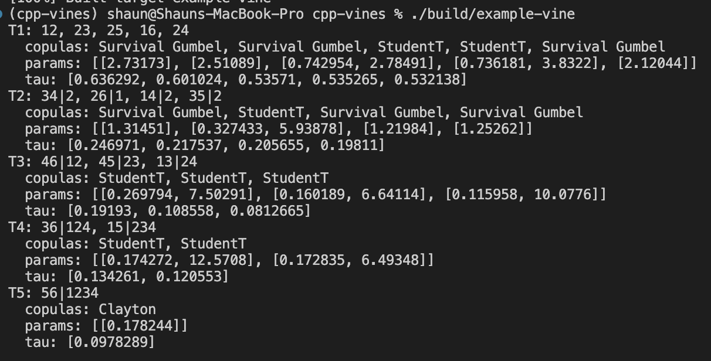

# cpp-vines



You can see from running `./build/example-vine ` above the results for fitting an R-Vine copula to
6 assets ecdf based log returns. This information can be used for computing CMPI (Cumulative Mispricing Index)
and determining a potential statistical arbitrage opportunity.

`cpp-vines` is a C++23 proof of concept for fitting regular-vine (R-vine)
copula models to aligned numerical series. It is aimed at experimenting with
dependence structures in asset returns, but the core accepts any aligned
floating-point marginals.

## Highlights

- **Fixed-capacity numerical series.** `FixedSeries` maintains a rolling
  window with constant-time updates to its running sum and mean. It can track
  prices, log returns, or other numerical inputs without continuously growing
  the active window.

- **Asset helpers.** `Asset` validates prices, derives log returns, and exposes
  empirical marginal (`u`) values for copula fitting.

- **Rolling empirical CDF.** `Ecdf` maintains a capacity-bounded empirical CDF
  for transforming a numerical series into marginal values.

- **Seven fitted pair-copula candidates.** Each selected edge evaluates
  Independence, Gaussian, and Student-t; positive-dependence edges also evaluate
  Clayton, survival Clayton, Gumbel, and survival Gumbel. Parametric fits run
  concurrently and the successful family with the lowest BIC is retained by
  default (AIC remains selectable).

- **Automatic R-vine construction.** The fitter ranks dependence with
  Kendall's tau, builds maximum-dependence spanning trees, enforces the
  regular-vine proximity condition, and carries h-function conditionals into
  higher trees.

- **Conditional-probability and CMPI outputs.** A fitted vine provides the
  final pair's two conditional-probability series as raw values, cumulative
  CMPI values, or CMPI z-scores.

- **Explicit error handling.** Public C++ operations use
  `std::expected<..., SmartError>` for invalid input, failed fits, and
  unavailable fitted state.

- **Optional Python bindings.** A pybind11 layer exposes assets, copulas,
  edges, fitted trees, and final results to Python. The C++ core is
  hand-written; the Python convenience layer was developed with LLM
  assistance as this was just added as a nice-to-have feature.

## C++ performance design

The project uses several low-latency and memory-conscious techniques in the
hot data and vine-construction paths:

- **Preallocated rolling storage.** `FixedSeries` allocates its backing track
  once, updates its rolling sum in constant time, and exposes its active window
  without allocating on every observation. The tracked window is periodically
  compacted in place rather than grown indefinitely.

- **Non-owning views where data is already owned.** C++ fitting accepts
  `std::span<const double>` marginals, and final fitted probabilities are
  returned as spans. This avoids copies between asset storage, vine fitting,
  and result inspection. Those views remain valid only until the vine is
  refitted or destroyed.

- **Reserved working buffers.** Candidate, tree, conditional-probability, and
  ECDF containers reserve their expected capacity before they are populated,
  reducing reallocations during fitting and streaming updates.

- **Compact vine metadata.** Conditioned and conditioning variable sets are
  represented as integer bitmasks. Union, intersection, and proximity checks
  therefore use inexpensive bitwise operations instead of heap-backed sets.

- **Fit only selected edges.** Candidate links are ranked by Kendall's tau to
  build each spanning tree first; copula optimisation is then performed only
  for the selected tree edges rather than every possible candidate pair.

- **Parallel family selection.** The parameterized copula-family
  optimisations for a selected edge run via `std::async`, reducing wall-clock
  fitting time on systems with available CPU parallelism. Independence is
  evaluated immediately because it has no parameters to optimize.

The ECDF keeps a sorted `std::vector`, so insertion is still linear in the
configured ECDF window. Likewise, vine fitting and numerical optimisation are
batch operations rather than hard real-time guarantees. The optimisations
above primarily reduce copying, allocation churn, and avoidable copula fits;
profile representative workloads before treating the library as a latency
critical production component.

## Model scope

`max_nodes` controls how many variables are retained in a fitted vine and
defaults to six. R-vine fitting cost grows quickly with both the number of
series and the number of candidate pair-copulas, so modest node counts are the
practical starting point for this proof of concept.

The project currently fits a model to the supplied observations and reports
the corresponding fitted conditional series. It does not yet provide model
serialization, online refitting, or out-of-sample scoring of a saved fitted
vine.

## Requirements

- CMake 3.23+
- A C++23 compiler
- Boost headers
- Python 3.10+ and `uv` when using the Python interface

On macOS:

```shell
brew install boost uv
```

## Build and run the C++ example

The example expects `prices.csv` in the repository root.

```shell
cmake -S . -B build
cmake --build build --target example-vine
./build/example-vine
```

To build the available native test executables as well:

```shell
cmake --build build
```

## Use from Python

Create the environment and build the extension through the project metadata:

```shell
uv venv
source .venv/bin/activate
uv sync
```

The walkthrough in [python/examples/vine.ipynb](python/examples/vine.ipynb)
loads the bundled price data, derives empirical marginals, fits a six-node
vine, and plots its final CMPI output.
